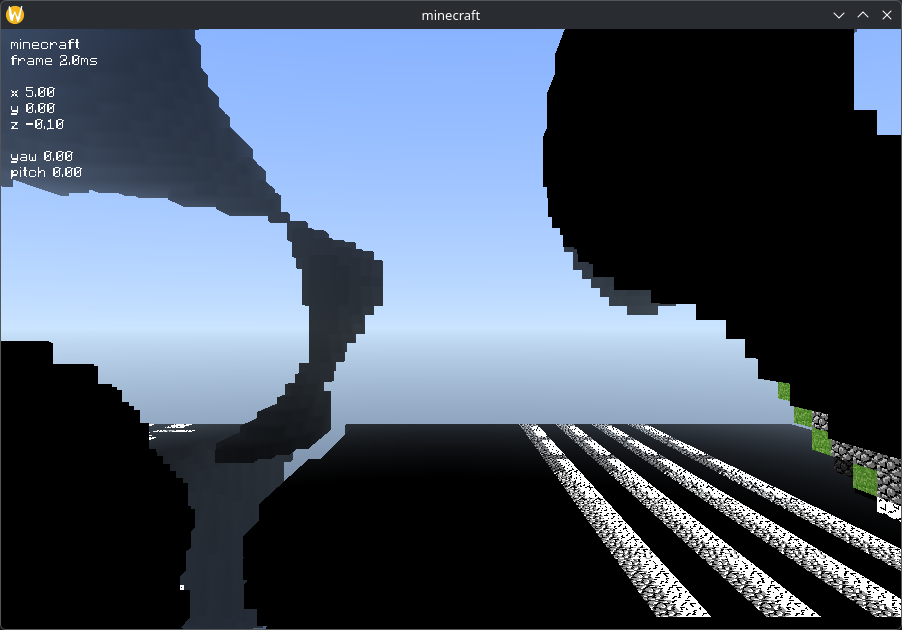

# minecraft


Minecraft in C89/OpenGL




## Features

- Infinite terrain generation
- Multiplayer (WIP)

## Dependencies

- Linux/WSL
- OpenGL 4.5
- C89 compiler
- CMake

## Build

```sh
git clone https://github.com/ludvigsandberg/minecraft
cd minecraft
cmake -B build -S . -DCMAKE_BUILD_TYPE=Release # or Debug
cmake --build build --config Release # or Debug
```

## Run

Locate the client in `build/` and run it
